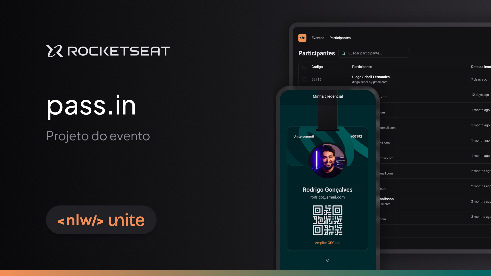

  

Aplicação desenvolvida no NLW Unite da Rocketseat na trilha HTML+CSS+JS.

  <a href="#-tecnologias">Tecnologias</a>&nbsp;&nbsp;&nbsp;|&nbsp;&nbsp;&nbsp;
  <a href="#-projeto">Projeto</a>&nbsp;&nbsp;&nbsp;|&nbsp;&nbsp;&nbsp;
  <a href="#memo-licença">Licença</a>

  

 

  

## 🚀 Tecnologias

Esse projeto foi desenvolvido com as seguintes tecnologias:

- HTML
- CSS
- JavaScript

## Projeto

Nesse projeto iremos desenvolver a versão simplificada de um sistema de check-in para eventos presenciais.

## Aprendizado

<h4>Aprendizados da aula 1</h4>

-  Criar e inserir listas com dados (no caso do projeto, dados dos participantes) no HTML pelo JavaScript de forma automatizada, sem a necessidade de criar um por um;

- Selecionar uma tag do HTML pelo JavaScript, e através de váriaveis (const, let) inserir dados / informações dentro da tag (no caso do projeto, inserir na lista de participantes suas informações);

- Como criar arrays e como manipular as informações dentro dela.

<h4>Aprendizados da aula 2</h4>

- Entendi como funciona o processo de lógica de programação, como devo pensar para criar algoritmos e instruir a linguagem;

- Aprendi a verificar se um elemento é verdadeiro ou falso, e a partir do resultado meu código tomar rumos diferentes;

- Manipular formulários, verificando se já existe uma informação igual a que está tentando ser inserida.

